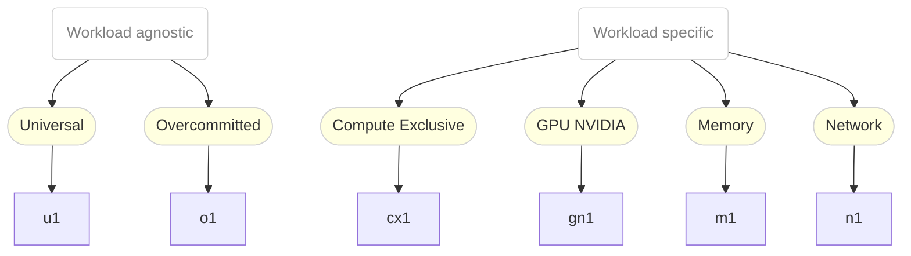

# kubevirt/common-instancetypes

A set of [instance types and preferences](https://kubevirt.io/user-guide/virtual_machines/instancetypes/) to help create [`KubeVirt`](https://kubevirt.io)  [`VirtualMachines`](http://kubevirt.io/api-reference/main/definitions.html#_v1alpha1_virtualmachine).

# Overview

## Structure

The available instance types can be divided into two categories:

1. Workload agnostic - or general purpose
2. Workload specific

Workload agnostic instance types are a good starting point to run your workload.
Once you know more about the requirements of your workload, you can start choosing a
workload specific instance type.

The following diagram summarizes the available instance types and their use-cases:



### Schema

<details><summary>Click in order to view the instance type names schema</summary>

```ebnf
instanceTypeName = seriesName , "." , size;

seriesName = ( class | vendorClass ) , version;

class = "u" | "o" | "cx" | "g" | "m" | "n";
vendorClass = "g" , vendorHint;
vendorHint = "n" | "i" | "a";
version = "1";

size = "small" | "medium" | "large" | [( "2" | "4" | "8" )] , "xlarge";
```
</details>

# Series

.                           |  U  |  O  |  CX  |  GN  |  M  |  N
----------------------------|-----|-----|------|------|-----|-----
*Has GPUs*                  |     |     |      |  ✓   |     |
*Hugepages*                 |     |     |  ✓   |      |  ✓  |  ✓
*Overcommitted Memory*      |     |  ✓  |      |      |     |
*Dedicated CPU*             |     |     |  ✓   |      |     |  ✓
*Burstable CPU performance* |  ✓  |  ✓  |      |  ✓   |  ✓  |
*Isolated emulator threads* |     |     |  ✓   |      |     |  ✓
*vNUMA*                     |     |     |  ✓   |      |     |
*vCPU-To-Memory Ratio*      | 1:4 | 1:4 |  1:2 |  1:4 | 1:8 | 1:2

## U Series

The U Series is quite neutral and provides resources for
general purpose applications.

*U* is the abbreviation for "Universal", hinting at the universal
attitude towards workloads.

VMs of instance types will share physical CPU cores on a
time-slice basis with other VMs.

### U Series Characteristics

Specific characteristics of this series are:
- *Burstable CPU performance* - The workload has a baseline compute
  performance but is permitted to burst beyond this baseline, if
  excess compute resources are available.
- *vCPU-To-Memory Ratio (1:4)* - A vCPU-to-Memory ratio of 1:4, for less
  noise per node.

## O Series

The O Series is based on the U Series, with the only difference
being that memory is overcommitted.

*O* is the abbreviation for "Overcommitted".

### UO Series Characteristics

Specific characteristics of this series are:
- *Burstable CPU performance* - The workload has a baseline compute
  performance but is permitted to burst beyond this baseline, if
  excess compute resources are available.
- *Overcommitted Memory* - Memory is over-committed in order to achieve
  a higher workload density.
- *vCPU-To-Memory Ratio (1:4)* - A vCPU-to-Memory ratio of 1:4, for less
  noise per node.

## CX Series

The CX Series provides exclusive compute resources for compute
intensive applications.

*CX* is the abbreviation of "Compute Exclusive".

The exclusive resources are given to the compute threads of the
VM. In order to ensure this, some additional cores (depending
on the number of disks and NICs) will be requested to offload
the IO threading from cores dedicated to the workload.
In addition, in this series, the NUMA topology of the used
cores is provided to the VM.

### CX Series Characteristics

Specific characteristics of this series are:
- *Hugepages* - Hugepages are used in order to improve memory
  performance.
- *Dedicated CPU* - Physical cores are exclusively assigned to every
  vCPU in order to provide fixed and high compute guarantees to the
  workload.
- *Isolated emulator threads* - Hypervisor emulator threads are isolated
  from the vCPUs in order to reduce emaulation related impact on the
  workload.
- *vNUMA* - Physical NUMA topology is reflected in the guest in order to
  optimize guest sided cache utilization.
- *vCPU-To-Memory Ratio (1:2)* - A vCPU-to-Memory ratio of 1:2.

## GN Series

The GN Series provides instances types intended for VMs with
NVIDIA GPU resources attached.

*GN* is the abbreviation of "GPU NVIDIA".

This series is intended to be used with VMs consuming GPUs
provided by the
[NVIDIA GPU Operator](https://github.com/NVIDIA/gpu-operator)
which can be installed on Kubernetes and also is made available
on OpenShift via OperatorHub.

### GN Series Characteristics

Specific characteristics of this series are:
- *Has GPUs* - Has GPUs predefined.
- *Burstable CPU performance* - The workload has a baseline compute
  performance but is permitted to burst beyond this baseline, if
  excess compute resources are available.
- *vCPU-To-Memory Ratio (1:4)* - A vCPU-to-Memory ratio of 1:4, for less
  noise per node.

## M Series

The M Series provides resources for memory intensive
applications.

*M* is the abbreviation of "Memory".

### M Series Characteristics

Specific characteristics of this series are:
- *Hugepages* - Hugepages are used in order to improve memory
  performance.
- *Burstable CPU performance* - The workload has a baseline compute
  performance but is permitted to burst beyond this baseline, if
  excess compute resources are available.
- *vCPU-To-Memory Ratio (1:8)* - A vCPU-to-Memory ratio of 1:8, for much
  less noise per node.

## N Series

The N Series provides resources for network intensive DPDK
applications, like VNFs.

*N* is the abbreviation for "Network".

This series of instancetypes requires nodes capable
of running DPDK workloads and being marked with the respective
node-role.kubevirt.io/worker-dpdk label as such.

### N Series Characteristics

Specific characteristics of this series are:
- *Hugepages* - Hugepages are used in order to improve memory
  performance.
- *Dedicated CPU* - Physical cores are exclusively assigned to every
  vCPU in order to provide fixed and high compute guarantees to the
  workload.
- *Isolated emulator threads* - Hypervisor emulator threads are isolated
  from the vCPUs in order to reduce emaulation related impact on the
  workload.
- *vCPU-To-Memory Ratio (1:2)* - A vCPU-to-Memory ratio of 1:2.

## Development

To get started with customizing or creating your own instancetypes and preferences
see [DEVELOPMENT.md](./DEVELOPMENT.md).

## Resources

The following instancetype resources (cluster-wide and namespaced) are
provided by this project:

Name | vCPUs | Memory
-----|-------|-------
cx1.2xlarge  |  8  |  16Gi
cx1.4xlarge  |  16  |  32Gi
cx1.8xlarge  |  32  |  64Gi
cx1.large  |  2  |  4Gi
cx1.medium  |  1  |  2Gi
cx1.xlarge  |  4  |  8Gi
gn1.2xlarge  |  8  |  32Gi
gn1.4xlarge  |  16  |  64Gi
gn1.8xlarge  |  32  |  128Gi
gn1.xlarge  |  4  |  16Gi
m1.2xlarge  |  8  |  64Gi
m1.4xlarge  |  16  |  128Gi
m1.8xlarge  |  32  |  256Gi
m1.large  |  2  |  16Gi
m1.xlarge  |  4  |  32Gi
n1.2xlarge  |  16  |  32Gi
n1.4xlarge  |  32  |  64Gi
n1.8xlarge  |  64  |  128Gi
n1.large  |  4  |  8Gi
n1.medium  |  4  |  4Gi
n1.xlarge  |  8  |  16Gi
o1.2xlarge  |  8  |  32Gi
o1.4xlarge  |  16  |  64Gi
o1.8xlarge  |  32  |  128Gi
o1.large  |  2  |  8Gi
o1.medium  |  1  |  4Gi
o1.micro  |  1  |  1Gi
o1.nano  |  1  |  512Mi
o1.small  |  1  |  2Gi
o1.xlarge  |  4  |  16Gi
u1.2xlarge  |  8  |  32Gi
u1.2xmedium  |  2  |  4Gi
u1.4xlarge  |  16  |  64Gi
u1.8xlarge  |  32  |  128Gi
u1.large  |  2  |  8Gi
u1.medium  |  1  |  4Gi
u1.micro  |  1  |  1Gi
u1.nano  |  1  |  512Mi
u1.small  |  1  |  2Gi
u1.xlarge  |  4  |  16Gi

The following preference resources (cluster-wide and namespaced) are
provided by this project:

Name | Guest OS
-----|---------
alpine | Alpine
centos.7 | CentOS 7
centos.7.desktop | CentOS 7
centos.stream8 | CentOS Stream 8
centos.stream8.desktop | CentOS Stream 8
centos.stream8.dpdk | CentOS Stream 8
centos.stream9 | CentOS Stream 9
centos.stream9.desktop | CentOS Stream 9
centos.stream9.dpdk | CentOS Stream 9
cirros | Cirros
fedora | Fedora
rhel.7 | Red Hat Enterprise Linux 7
rhel.7.desktop | Red Hat Enterprise Linux 7
rhel.8 | Red Hat Enterprise Linux 8
rhel.8.desktop | Red Hat Enterprise Linux 8
rhel.8.dpdk | Red Hat Enterprise Linux 8
rhel.9 | Red Hat Enterprise Linux 9
rhel.9.desktop | Red Hat Enterprise Linux 9
rhel.9.dpdk | Red Hat Enterprise Linux 9
ubuntu | Ubuntu
windows.10 | Microsoft Windows 10
windows.10.virtio | Microsoft Windows 10 (virtio)
windows.11 | Microsoft Windows 11
windows.11.virtio | Microsoft Windows 11 (virtio)
windows.2k16 | Microsoft Windows Server 2016
windows.2k16.virtio | Microsoft Windows Server 2016 (virtio)
windows.2k19 | Microsoft Windows Server 2019
windows.2k19.virtio | Microsoft Windows Server 2019 (virtio)
windows.2k22 | Microsoft Windows Server 2022
windows.2k22.virtio | Microsoft Windows Server 2022 (virtio)
